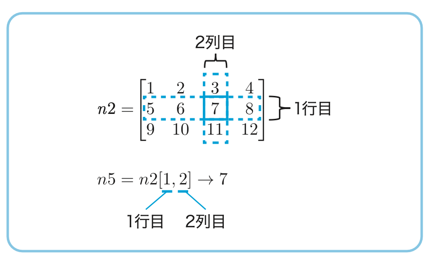

# 書籍「最短コースでわかるPythonプログラミングとデータ分析」サポートサイト

 

　当サイトは、書籍「**最短コースでわかるPythonプログラミングとデータ分析**」のサポートサイトです。  
　本書は、人気のプログラミング言語「Python」で、データ分析プログラミングができるようになる本です。  
　Python文法の初歩から解説しているので、初心者でも他書に頼らず、**本書1冊で Python によるデータ分析技術をマスター**できます！

## 実習Notebookリンク
　本書の実習コードは、Google Colabで動かすことを前提に、すべてGithub(当サポートサイト)で公開しています。  

* [1章　Python入門](refs/notebooks.md#CH01)
* [2章　データ分析ライブラリ入門編](refs/notebooks.md#CH02)
* [3章　データ分析ライブラリ中級編・4章　データ分析実践編](refs/notebooks.md#CH03_CH04)

<!---
[実習Notebookの動かし方](refs/how-to-run.md)
-->  

## Amazonへのリンク

[単行本](https://www.amazon.co.jp/dp/4296201123) 

<!---
[Kindle](https://www.amazon.co.jp/dp/B09G622WB6/)  
-->  

　
## 本書の特徴
本書は、以下の3つの「ツボ」により「**最短コースでデータ分析技術を習得をできる『高速道路』**」を読者に提供します。

* **学習内容を最低限に抑える**

本書では、学習対象の知識項目を必要最小限に抑え、相互の関連性に基づき体系的に学べるようにしています。  
1章と2章の約200ページで、プログラミング経験のない読者も、データ分析で最低限必要な3つのライブラリNumpy, Matplotlib, pandasまで使いこなせるようになります。

* **演習問題でプログラミングの実地訓練を積む**

初心者にとってプログラミング習得時の高いハードルの一つは、「要件」をプログラムコードとしての「実装」に落とし込むことのイメージが持てない点です。  
本書では、各節の最後にある演習問題を通じて、抽象的な「要件」を具体的な「実装」に落とし込む訓練を繰り返すことにより、この課題に対応します。

* **開発環境(Google Colab)上の試行錯誤で体得**

関数の細かい挙動はトライアンドエラーを繰り返して実験・体験により理解するのが第一です。  
本書ではGoogle Colabで動かすことを前提に、すぐに利用可能な実習コードが用意されていて、気軽に試行錯誤の実験ができます。

更に、3章・4章では、**公開データセットの活用**で、**実業務に近い分析シナリオを提示**しています。  
これらの例題を通じて、実際のデータ分析で最も重要な**洞察の抽出**がどんなものであるかのイメージを持つことが可能です。

以下に、本書の特徴的な図表の例を掲載しておきます。

* **重要な文法は囲み記事で解説**  

1章のPythonプログラミング入門では、重要な文法は囲み記事で一つ一つの要素の意味を丁寧に解説します。

 

<!---
* **演習問題はコメント文のヒントで解きやすい形に**

演習問題では、解答セルに実装に関するヒントが記載されています。  
ヒントに沿った形でコードを記述していくと、解答にたどりつけるようになっています。

-->  

* **NumPyのインデックス参照は図を使って丁寧に解説**

NumPyのインデックス参照は初心者にとってわかりにくい点の一つです。 
この点も、図を使って丁寧に解説しています。

  

* **ブロードキャスト機能も図で説明**

NumPyの特徴的な機能であるブロードキャスト機能も、その動作メカニズムを図で解説しています。

## 主な想定読者
本書は、次のような読者を想定しています。

1. データ分析をするためにPython文法から学習したい

2. Pythonの文法は理解したが、ライブラリの学習で止まっている

3. ライブラリまで一通り学習したが、実際の分析テーマに対してどのように進めたらいいかがわからない

## 目次

### 1章　Pythonプログラミング入門
### 2章　データ分析ライブラリ入門編
### 3章　データ分析ライブラリ中級編
### 4章　データ分析実践編

[目次詳細](refs/index.md)

## その他解説記事

## リンク集

### 著者発信の情報

|ソース  |タイトルとリンク  |補足|
|---|---|---|
|twitter|[@makaishi2](https://twitter.com/makaishi2)|著者のツイッターアカウント。書籍に関連した情報発信とretweetが中心です。|
|IBM Blog|[AI関連書籍三冊目を出版したIBM赤石雅典に聞く「AIと仕事と執筆」](https://www.ibm.com/blogs/solutions/jp-ja/data_science_and_ai_akaishi-san/)|IBM勤務時代、会社のブログにインタビュー記事が紹介されています。|

### 外部リンク

<!---

|ソース  |タイトルとリンク  |補足|
|---|---|---|
|Amazon|[Amazonレビュー](https://www.amazon.co.jp/product-reviews/4296110322)||
|Honto|[Honto](https://honto.jp/netstore/pd-book_31207319.html)||
|読書メーター|[読書メーター](https://bookmeter.com/books/18544605)||
|BookLive|[BookLive](https://booklive.jp/product/index/title_id/1014297/vol_no/001)||

-->  

***

## 正誤訂正・FAQ

<!---
* [Notebook補足情報](notebook-ref.md)
-->  

* [正誤訂正](refs/errors.md)

* [FAQ](refs/faqs.md)

